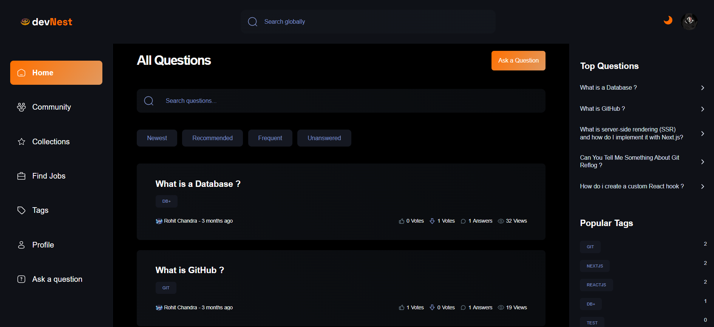

# 🚀 devNest: AI-Powered Community Forum  

**DevNest** is a **full-stack Q&A platform** where developers get **instant AI answers** (Gemini API) and **community-validated solutions**. Built with **Next.js**, **MongoDB**, and **Clerk Auth**, it's like Stack Overflow — but smarter, faster, and gamified.  

  

## 🌟 Live Website  
Experience in action:  
🔗 **[https://dev-nest-v-1.vercel.app](https://dev-nest-v-1.vercel.app/)**

## ✨ Features  

- 🤖 **AI-Powered Answers**  
  Gemini API generates instant responses — no more waiting for human replies.  
- 🔥 **Community Gamification**  
  Upvote/downvote answers, earn badges, and climb leaderboards.  
- 🏷️ **Smart Tagging**  
  Auto-categorize questions for seamless discovery (e.g., `#react`, `#python`).  
- 💼 **Job-Matching**  
  Get tailored job recommendations based on your Q&A activity.  
- 📚 **Collections**  
  Bookmark and organize answers into personal knowledge libraries.  
- ⚡ **Next.js Optimized**  
  SSR + ISR for blazing-fast page loads.  

## 🛠️ Tech Stack  

| Layer          | Technology Used |  
|----------------|-----------------|  
| **Frontend**   | Next.js 14, TypeScript, TailwindCSS, ShadCN-UI |  
| **Backend**    | Next.js Server Actions, Prisma, Zod |  
| **Database**   | MongoDB (Mongoose ODM) |  
| **Auth**       | Clerk |  
| **AI**         | Gemini API, RapidAPI |  

## 🧠 How It Works  

### **AI + Human Hybrid Model**  
1. **User posts question** → Gemini API drafts an instant answer.  
2. **Community votes** refine answer quality (✅ upvote / ❌ downvote).  
3. **Top answers** get pinned + tagged for future searches.  

### **Performance Optimizations**  
- **Cached AI Responses**: Store frequent queries to reduce API calls.  
- **MongoDB Indexing**: Speeds up tag-based searches by 4x.

## 🤝 Contribute  
PRs welcome! Tag issues with `first-issue`.  
